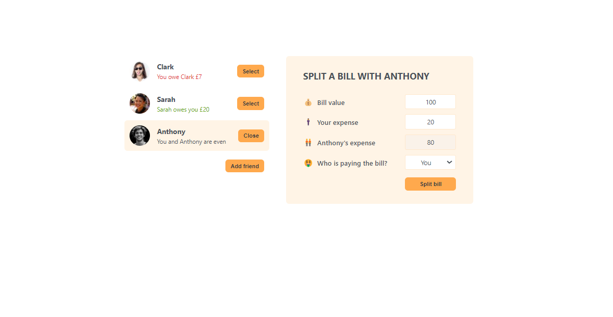

# eat-n-split

This project was bootstrapped with CRA. This is a simple React application that allows users to add friends to the list of friends and calculate who owes and what amount after splitting the bill.
 